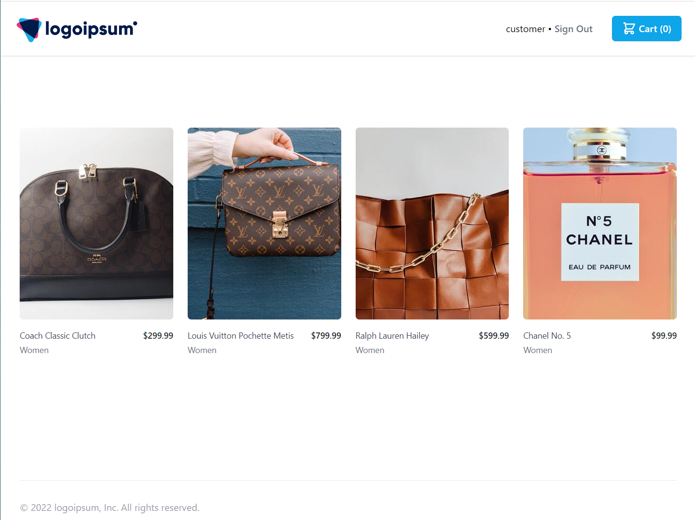
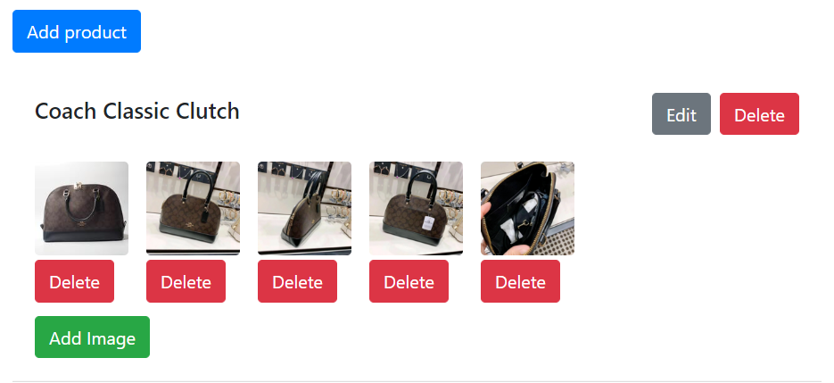

# avenue

**A sample e-commerce application**

This application consists of two projects - `backend` and `fronend`.
The backend is built on [Django](https://docs.djangoproject.com/en/4.0/) and the frontend is built using [React](https://create-react-app.dev/).

<br/>

# Quickstart
**avenue** can be run locally with `docker` and `docker compose`. Please clone the repository and run `docker compose` as follows:

```
git clone git@github.com:sroy0101/avenue.git
cd avenue
docker compose up
```

Next, add some seed data -- pre-created users, products and images -- to start testing immediately:

```
# Start bash in the avenue backend container
docker exec -it web bash

# Run the data importer
./bin/seed_db
```

Finally, open `localhost:8000` to see the store with available products.


**See all seed data user login credentials at the end of this document.**

<br/>

# Screenshots

<br/>

## Store home page


## Product Listing


## Product Editing



# Project Details

## Backend

The `backend` consists of three Django apps:
- `product` - an app to allow merhandizers to crate products and upload product images. It provides the REST api endpoint used by the `frontend`.
- `store` - an app to allow store customers to view the products and add selected products to a cart. The frontend for this app uses Django templates for better SEO.
- `accounts` - an app to create and administer users in Django.

## Frontend

The `frontend` React app consists of three components, bound together the by the App.js module:
- `LoginModal` - for displaying the login form, collecting the username and password.
- `EditModal` - for displaying the product form to create or edit products.
- `EditImageModal` - for displaying the form adding product images.

`App.js`
- Renders the product list along with the product images.
- Contains all the other supporing functions such as making api calls to the backend for login and adding or deleting products or images.


<br/><br/>

# Development Setup
<br/>

## Backend

1. Clone the `avenue` git repo from Github in your project folder.

```
git clone git@github.com:sroy0101/avenue.git
```

2. Create and activate python virtual env.
(Requires [Python 3.7+](https://www.python.org/downloads/) to be already installed on your system.)

```
cd avenue
python -m venv venv
source venv/bin/activate
```

3. Install python packages

```
cd backend
pip install -r requirements.txt

```

4. Install ImageMagic

```
apt-get install libmagickwand-dev
```

5. Run tests

```
./bin/runtests
```

6. Run migration to create the sqlite database (db.sqlite3):

```
python manage.py migrate
```

7. Run backend

```
python manage.py runserver
```

**The backend Django server should now be running**.

Go to `localhost:8000/api/schema/swagger-ui` to see the `Product` and `ProductImage` API schema.

Note: Trying the API from the `swagger-ui` interface requires user authentication (see below for how to create users).

<br/>

## Seed data for a quick start

1. Load the seed data.
```
cd backend
./bin/seed_data
```
2. Login as super-admin on `localhost:8000/admin` to chek the othe user and the list of products.
3. Open `localhost:8000` in web browser to see the users, product list and images.
4. Login via `localhost:3000` in web browser to see product list and images.

**See all seed data user login credentials below. **

<br/>

## Create users and products manually

1. Add a superuser (make sure application is running)
```
cd backend
python manage.py createsuperuser
```

You'll then be prompted to create your username and password
```
Username: <superuser name>
Email address: XXX@example.com
Password:
Password (again):
Superuser created successfully.
```
2. Open `localhost:8000/admin` on the web browser and login as superuser.
3. Create new users using admin UI.
   - Add a user and assign the user to a group called `Merchandiser`.
   - Add another user as a customer who will make purchases at the store.
4. Open `localhost:8000/api/schema/swagger-ui` to see the list of API's.
5. Open `localhost:8000` to see available products.

<br/>

## Frontend

1. Install node packages
```
cd frontend
npm install
```
2. Run the app
```
npm start
```
3. Open `localhost:3000` on the web browser and login as the merchandiser user to add products and images.
<br/>
<br/>

## Seed Data Login Details

* Superuser -  `superuser / su@@1234`
* Merchandiser - `product_manager / pypy!1234`
* customer - `customer / pypy!1234`
* customer (with no cc data) - `customer_no_cc / pypy!1234`
<br/>
<br/>

## Future Functionaility

- Moving media files to S3/Cloudfront with the use of Localstack for testing.
- End-to-end testing using Cypress testing framework.
- Continuous integration and deployment (CI/CD) pipelines.
- Deployment to K8s.
-